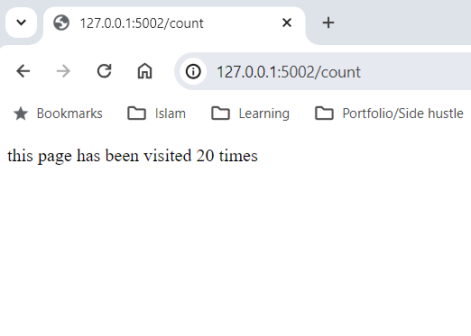

## Mastering Docker Basics Through Practical Projects

**A Structured, Hands-On Introduction to Containers, Networking & Multi-Service Architecture**

This repository is designed as a foundational learning resource for anyone looking to understand Docker through simple, practical examples. 
Instead of learning Docker in theory, I built multiple containerized applications, each focusing on a core Docker concept:
- Single containers
- Container-to-container communication
- Redis, MySQL, NginX as services
- Docker Compose orchestration
- Scaling containers with load balancing
- Persistent storage & environment variables
- Pushing & pulling images from public and private repositories (DockerHub & AWS ECR)

**This README explains what was built, why it matters, how it works, and what others can learn from it.**

### 1. hello_flask (Flask with MySQL)

This project demonstrates how web apps interact with relational databases inside Docker.

#### What Was Built
- A simple Flask Web Application connected to a MySQL database
- A multi-stage Dockerfile
- MySQL image pulled from DockerHub
- An image for the Flask App
- A container network
- A docker compose file

Docker Compose orchestrating the services

#### Why This Matters
This project teaches:
- Connecting to MySQL database:
    - install MySQL:
        `sudo apt update`
        `sudo apt install mysql`
    - then connect to it in app file:
        ```python
        db = MySQLdb.connect(
            host="mydb",    # Hostname of the MySQL container
            user="root",    # Username to connect to MySQL
            passwd="my-secret-pw",  # Password for the MySQL user
            db="mysql"      # Name of the database to connect to
        )
        ```
- Multi-stage Dockerfile to optimize the container's deployment time:
    **#Stage 1: Build**
    **FROM python:3.8-slim as Build**
    **WORKDIR /app**
   **RUN apt-get update && apt-get install -y \***
        **gcc \***
        **python3-dev \***
        **libmariadb-dev \***
        **pkg-config**
    **COPY . .**
    **RUN pip install flask mysqlclient**

    **#Stage 2: Producion**
    **FROM python:3.8-slim**
    **WORKDIR /app**
    **COPY --from=Build /app /app**
    **EXPOSE 5002**
    **CMD ["python", "app.py"]**
- Proper Docker Compose structuring for DB services:
    **mydb:**
       **image: mysql:5.7**
        **environment:**
            **MYSQL_ROOT_PASSWORD: my-secret-pw**
- Pulling images from DockerHub:
    - Create an account on DockerHub
    - Login to DockerHub through the terminal and enter your details:
        `docker login`
    - Then pull the image from DockerHub:
        `docker pull mysql`
- Creating an images for applications:
     `docker build -t app-image .`
- Creating networks to link multiple containers together:
    - Create a network with following command
        `docker network <name>`
        example:
        `docker network my-network`
    - Run the containers linking to the created network:
        `docker run -d --name <name_container> --network <name_network> -p <port number:port number> <image_name>`
        example:
        `docker run -d --name my-app1 --network my-network -p 5002:5002 app-image`
        And run this for the other container as well.
        `docker run -d --name my-app2 --network my-network -p 5002:5002 mysql`
- Creating docker compose file makes it much easier, you basically run one command and Docker runs all the commands above, creating network to running the containers:
    `docker compose up`

#### Key Lessons
- Understand the workflow, app -> create dockerfile ->  create or pull docker image -> create network -> build and run container with linking to network.
- Docker Compose simplifies the whole workflow, app -> create dockerfile -> create or pull docker image -> create docker-copmpose.yml -> run containers with docker compose.
- How networks allow app -> database communication with containers.
- Connecting to DockerHub and pulling images
- 

### 2. CoderCo Multi-Container Challenge

A simple multi-container setup that demonstrates persistent storage, environment variables and scaling with load balancing.

#### What was built
- A simple **Flask Web Application** with two endpoints:
    - **/** - Welcome message
        </img>
    - **/count** - Persistent visit counter stored in Redis
        </img>
- A **Redis database container** functioning as a key-value store
- A **Docker Compose** stack managing both services
- Persistent Redis storage using volume
- Environment-variables was included
- Scaling of Flask application with NginX load balancing

#### Why this matters
This project teaches:
- How stateful services like Redis persist data
- How to scale application when the trafic load increases
- How Docker Compose runs multi-container application
- How to store images for future usage

#### What you will learn from this project
- Correctly structuring Dockerfiles and Docker Compose files
- Build Docker images:
   `docker build -t <add name to the image> <location/directory of the dockerfile>`
   example:
    `docker build -t app-image .` app-image as the name and "." as inside of the current directory
- Using volumes to avoid data loss:
    example from the project's docker-compose file where Redis use volume for persistent storage: 
        redis:
            image: redis:latest
            ports:
                - '6379:6379'
            **volumes:**
                **- redis-data:/data**
    **volumes:**
        **redis-data:**
            **driver: local**    
- Scaling web services with:
    `docker compose up --scale <name of web service in compose file>="number of instances"`
    example from the project:
    `docker compose up --scale web=3`
- Debugging failing containers & connection issues
